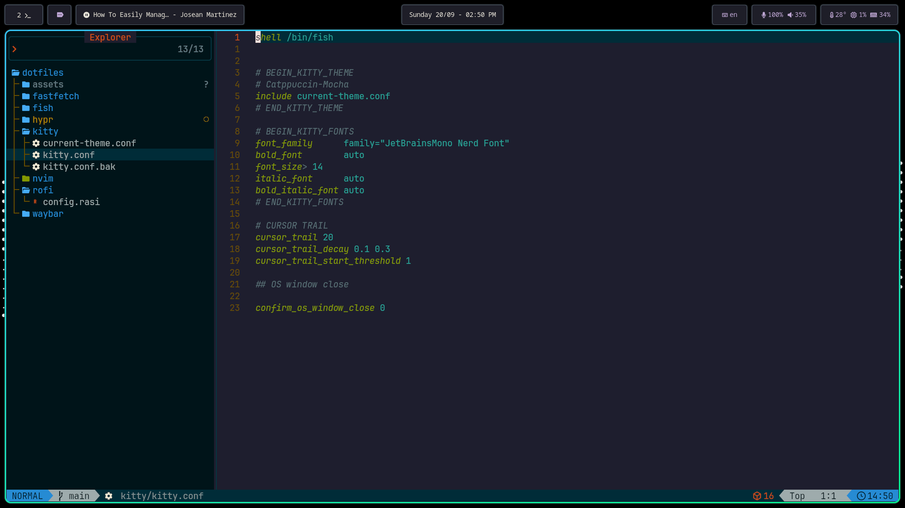
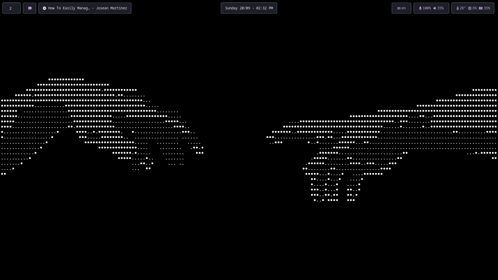
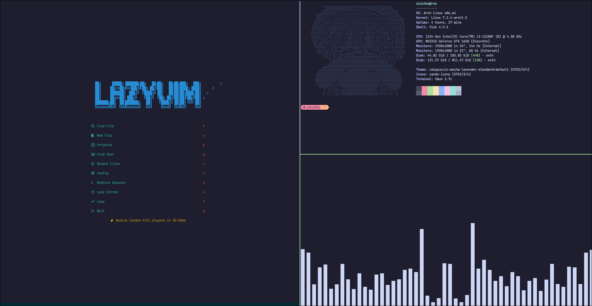

# Dotfiles
>[!NOTE]
>i use arch btw

This repository contains all my configurations and scripts. 
It’s meant as a reference for how I set up my environment.

These files reflect my workflow and personal taste. Browse through, grab
ideas, and build your own setup <3

## Setup
- **OS:** [Arch Linux](https://github.com/archlinux)
- **WM:** [Hyprland](https://github.com/hyprwm/Hyprland)
- **Terminal:** [Kitty](https://github.com/kovidgoyal/kitty)
- **Shell:** [Fish](https://github.com/fish-shell/fish-shell)
- **Font:** [JetBrainsMono](https://www.jetbrains.com/lp/mono/)
- **Theme:** [Catppuccin](https://github.com/catppuccin)
  - **GDK:** [catppuccin-gdk-theme](https://github.com/Fausto-Korpsvart/Catppuccin-GTK-Theme)
  - **QT:** [catppuccin-qt-theme](https://github.com/catppuccin/qtcreator)
  - **Icon:** [candy-icons](https://github.com/EliverLara/candy-icons)
- **Cursor:** [Hackneyed](https://www.gnome-look.org/p/999998)
- **Bar:** [Waybar](https://github.com/Alexays/Waybar)
- **Lock:** [Hyprlock](https://github.com/hyprwm/hyprlock/)
- **Launcher:** [Rofi](https://github.com/davatorium/rofi)
- **Music Player:** [mpd](https://github.com/MusicPlayerDaemon/MPD) + [ncmpcpp](https://github.com/ncmpcpp/ncmpcpp)
- **File Managers:** [Dolphin](https://github.com/KDE/dolphin) (GUI), [Yazi](https://yazi-rs.github.io/) (TUI)
- **Editor(IDE):** [Neovim](https://github.com/neovim/neovim) ([config](https://github.com/LazyVim/LazyVim))
> Terminal Lover ♥

